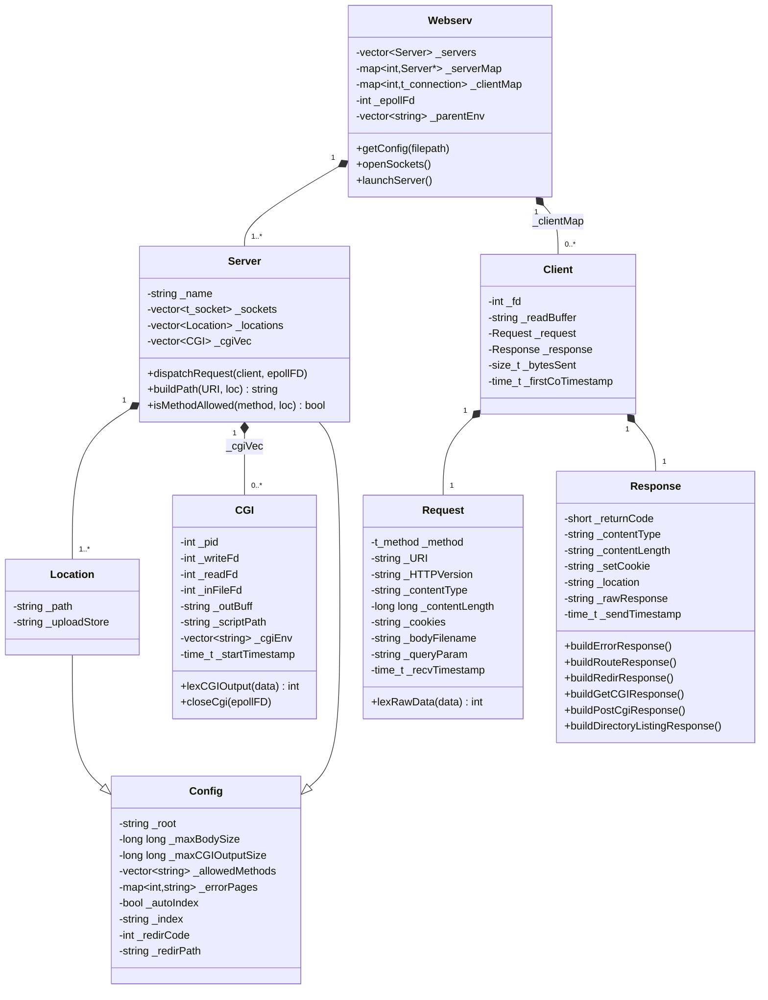
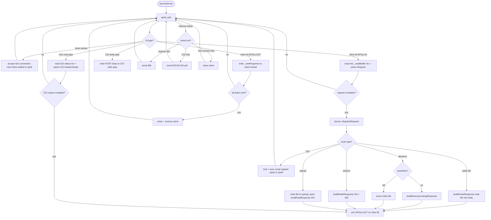

*This project has been created as part of the 42 curriculum by [mturgeon](https://github.com/Maxkirit), [sravizza](https://github.com/Piccolo-42), and [mkeerewe](https://github.com/tkeereweer)*

# webserv

A non-blocking HTTP/1.0 server written in C++98, built as part of the 42 school curriculum.

---

## Description

**webserv** is an HTTP server implemented from scratch in C++98. It closely follows [RFC 1945](https://www.rfc-editor.org/rfc/rfc1945) (HTTP/1.0), with cookie support borrowed from HTTP/1.1.

Key characteristics:
- **Event-driven I/O** via Linux `epoll` — a single process handles all connections concurrently without blocking
- **Non-blocking sockets** throughout: listen sockets, client connections, and CGI pipes are all registered in the epoll interest list
- **Linux-only** — epoll is a Linux kernel interface and is not available on macOS or BSD

---

## Architecture

### Class Structure



### Epoll Event Loop



---

## Features

### HTTP Methods

| Method   | Description                                      |
|----------|--------------------------------------------------|
| `GET`    | Serve static files and directory listings        |
| `POST`   | Process form data and file uploads via CGI       |
| `DELETE` | Delete a file at the requested URI               |

Requests using any other method receive a `405 Method Not Allowed` response with an `Allow:` header listing the permitted methods for that location.

### CGI

CGI scripts are executed by forking a child process and communicating via pipes registered in epoll. Supported interpreters are auto-detected from `PATH`:

- **Python 3** (`.py`)
- **PHP** (`.php`)

Environment variables passed to the CGI process: `QUERY_STRING`, `CONTENT_LENGTH`, `COOKIE`.

CGI response headers parsed: `Content-Type`, `Content-Length`, `Status`, `Set-Cookie`, `Location`.

A CGI process that does not complete within **30 seconds** is killed and a `503 Service Unavailable` is returned.

### File Upload

Files are uploaded via POST to a location with an `upload_store` directive. The file is written to the configured directory and the server responds with `201 Created` including the URI of the uploaded file.

Body size is enforced by `client_max_body_size`; payloads exceeding the limit receive `413 Payload Too Large`.

### Cookies and Session Management

- Incoming `Cookie:` headers are parsed and stored per request
- Cookies are forwarded to CGI scripts via the `COOKIE` environment variable
- CGI scripts can set cookies in responses via `Set-Cookie:` headers, which the server forwards to the client
- Session state (e.g. visit counters) is managed by CGI scripts, not the server itself

### Timeouts

| Timeout                   | Duration | Trigger                                      |
|---------------------------|----------|----------------------------------------------|
| First connection timeout  | 55 s     | No data received since connection was opened |
| Request read timeout      | 30 s     | No data received since last read             |
| Response write timeout    | 30 s     | No data sent since last write                |
| CGI execution timeout     | 30 s     | CGI child process has not exited             |

Request timeouts return `408 Request Timeout`; CGI timeouts return `503 Service Unavailable`.

### Directory Listing (Autoindex)

When `autoindex on` is set for a location and no index file is found, the server generates an HTML directory listing with working parent-directory navigation.

### Redirects

The `return` directive issues an HTTP redirect from any location block:

```nginx
location /old-path {
    return 301 http://example.com/new-path;
}
```

### Custom Error Pages

Error pages can be configured per server block and per location block. The server ships with default error pages for all handled codes:

`400` `403` `404` `405` `408` `409` `411` `413` `414` `500` `502` `503` `505`

### Multiple Virtual Hosts

A single config file can define multiple `server` blocks, each listening on a different address/port. All sockets are managed in the same epoll loop:

```nginx
server {
    listen 0.0.0.0/8080;
    # ...
}

server {
    listen 0.0.0.0/9090;
    # ...
}
```

---

## Configuration File

The config file uses nginx-like syntax. Pass it as the first argument to the binary; defaults to `config/default.conf`.

### Full Example

```nginx
server {
    listen 127.0.0.1/8080;
    server_name webserv;
    client_max_body_size 80000000;
    cgi_max_output_size  20000000;
    root /data/www/blue;

    error_page 404 pages/errors/404.html;
    error_page 500 pages/errors/500.html;

    location / {
        root         /data/www/blue/pages;
        limit_except GET, POST;
        autoindex    on;
        index        index.html;
        upload_store /data/upload;
        error_page   404 errors/404.html;
    }

    location /files {
        return 301 http://127.0.0.1:8080/cgi-bin/list_files.py;
    }

    location /cgi-bin {
        autoindex    off;
        limit_except GET, POST;
    }
}
```

### Supported Directives

#### Server block

| Directive              | Value                    | Description                                        |
|------------------------|--------------------------|----------------------------------------------------|
| `listen`               | `IP/PORT`                | Address and port to bind (repeatable)              |
| `server_name`          | string                   | Identifier for this server block                   |
| `root`                 | absolute path            | Default document root                              |
| `client_max_body_size` | integer (bytes)          | Maximum allowed request body size                  |
| `cgi_max_output_size`  | integer (bytes)          | Maximum allowed CGI response size                  |
| `error_page`           | `CODE path`              | Custom error page (repeatable, 4xx and 5xx only)   |
| `location`             | `path { ... }`           | Route configuration block (repeatable)             |

#### Location block

| Directive      | Value                    | Description                                              |
|----------------|--------------------------|----------------------------------------------------------|
| `root`         | absolute path            | Document root for this location                          |
| `limit_except` | `METHOD, ...`            | Allowed methods: `GET`, `POST`, `DELETE`                 |
| `autoindex`    | `on` \| `off`            | Enable HTML directory listing                            |
| `index`        | filename                 | Default file to serve for directory requests             |
| `upload_store` | absolute path            | Directory where uploaded files are written               |
| `error_page`   | `CODE path`              | Custom error page for this location (repeatable)         |
| `return`       | `STATUS_CODE URL`        | Redirect (status code must be 300–399)                   |

#### Parsing rules

- Paths must be absolute (start with `/`)
- `client_max_body_size` / `cgi_max_output_size` accept plain integers only (no `K`, `M` suffixes)
- Methods must be uppercase (`GET`, not `get`)
- `autoindex` only accepts `on` or `off` (lowercase)
- Missing semicolons or braces are hard parse errors

---

## Compilation and Execution

### Requirements

- **Linux** (epoll is not available on macOS/BSD)
- `c++` with C++98 support
- `python3` and/or `php` in `PATH` for CGI scripts

On macOS, use a container running linux to build and exucute the program.

### Build

```bash
make        # build ./webserv
make re     # full rebuild
make clean  # remove object files
make fclean # remove object files and binary
```

### Run

```bash
./webserv                        # uses config/default.conf
./webserv config/mysite.conf     # custom config
```

### Required File Structure for the Demo Website

The default config expects the following layout relative to the repository root:

```
data/
├── upload/                  # writable directory for uploaded files
└── www/
    ├── default-errors/      # fallback error pages
    ├── blue/                # virtual host on port 8080
    │   ├── assets/
    │   ├── cgi-bin/         # Python and PHP scripts
    │   ├── css/
    │   ├── pages/
    │   │   ├── index.html
    │   │   └── errors/
    │   └── session_management/
    └── green/               # virtual host on port 9090
        ├── assets/
        ├── cgi-bin/
        ├── css/
        ├── pages/
        │   ├── index.html
        │   └── errors/
        └── session_management/
```

---

## Testing

### Config File Parsing Tests

`tests/test_config.cpp` contains 110+ unit tests covering:

- Valid configs: minimal, full, multiple server and location blocks
- Syntax errors: missing braces, missing semicolons
- Invalid values: negative sizes, float sizes, out-of-range status codes
- Unknown directives: `ssl`, `proxy_pass`, `include`, etc.

### Request Parsing Tests

- `tests/http/simpleRequestTest.cpp` — parses single-line HTTP requests
- `tests/http/fullRequestTest.cpp` — parses multi-line requests including bodies written to temp files
- `tests/http/HTTP_Requests*.txt` / `wrong_requests.txt` — collections of valid and malformed request fixtures

### Response Status Tests

`tests/request_concurrent_validation.py` sends concurrent requests and validates the returned status codes against expected values.

### Slow Client Test

`tests/slow_crawl.py` simulates a slow client that sends request data one byte at a time, verifying that the server's timeout logic fires correctly.

### Stress Tests

Stress tests live in `tests/stress_test/` and use Docker to isolate the server and the load generator.

**Setup:**

```bash
# Create a shared Docker network
docker network create test-network

# Build the server image (from repo root)
docker build -t serv-env -f Dockerfile.server .

# Build the tester image (from tests/stress_test/)
docker build -t test-env -f Dockerfile.tester .

# Start the server container
docker run -it --rm --network=test-network -p 9090:9090 --name=server \
    -v /path/to/webserv:/webserv serv-env bash

# Start the tester container
docker run -it --rm --network=test-network --name=tester \
    -v /path/to/webserv/tests/stress_test/data:/data test-env bash
```

**Available scripts (run inside the tester container):**

| Script                    | Description                                      |
|---------------------------|--------------------------------------------------|
| `simple_test.sh`          | 200 concurrent connections for 60 seconds        |
| `flood_test.sh`           | 255 concurrent connections                       |
| `random_urls_get_test.sh` | GET requests against a randomised URL list       |

---

## Resources

- [RFC 1945 — HTTP/1.0](https://www.rfc-editor.org/rfc/rfc1945)
- [RFC 2109 — HTTP State Management (Cookies)](https://www.rfc-editor.org/rfc/rfc2109)
- [RFC 3875 — The Common Gateway Interface (CGI/1.1)](https://www.rfc-editor.org/rfc/rfc3875)
- [Beej's Guide to Network Programming](https://beej.us/guide/bgnet/html/index-wide.html)
- [NGINX Documentation](https://nginx.org/en/docs/)
- [epoll(7) — Linux manual page](https://man7.org/linux/man-pages/man7/epoll.7.html)

AI was used to deepen our understanding of networking concepts. The testing infrasturcture was also set up by AI.
